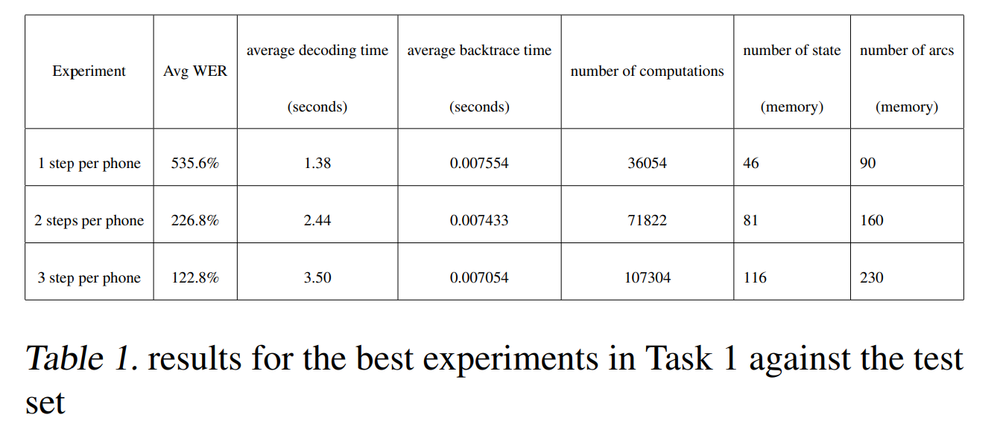
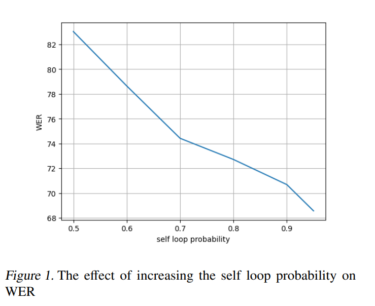
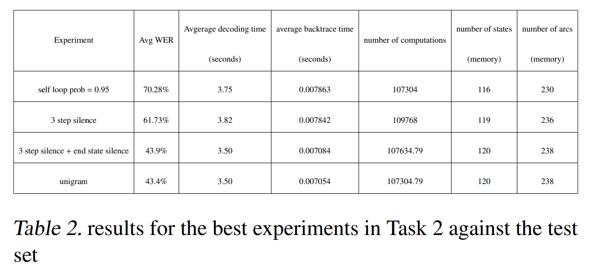
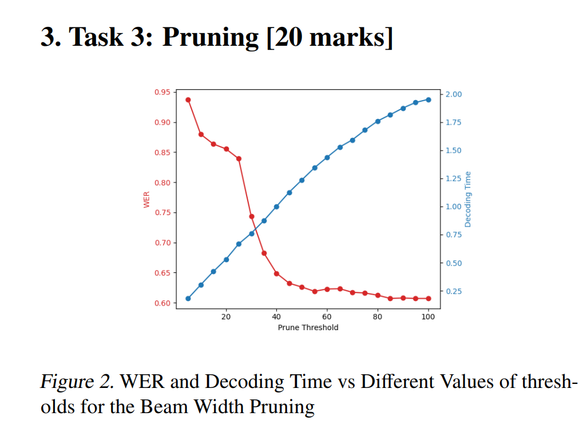
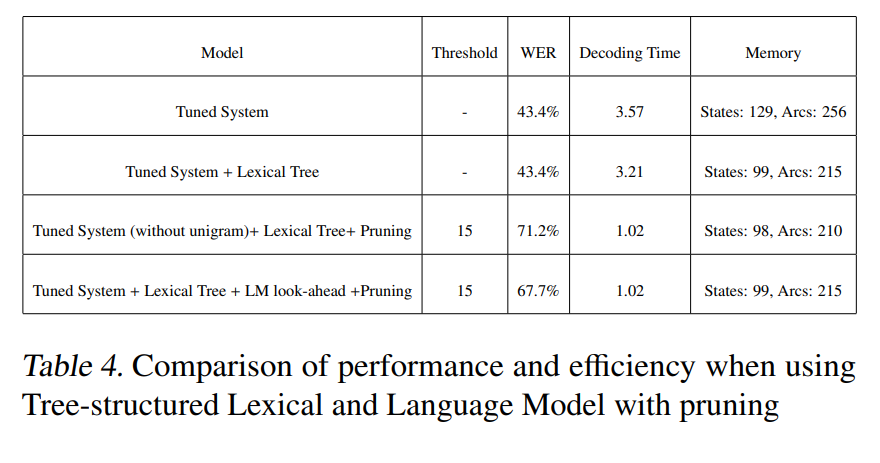
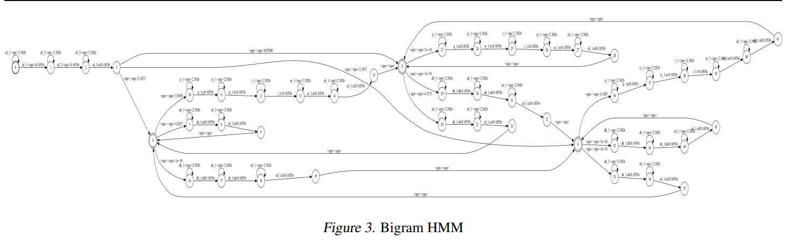

# Automatic Speech Recognition System

This repository contains code for an HMM-based automatic speech recognition (ASR) system implemented for a university course assignment. 

## Overview

The ASR system implements acoustic and language modeling components to transcribe audio recordings of spoken English into text. Key aspects include:

- Weighted finite-state transducers (WFSTs) to represent the acoustic and language models
- Viterbi algorithm for decoding
- Beam search and pruning for efficiency
- Lexical tree structure and look-ahead techniques
- Unigram and bigram language models

## Experiments

The report describes experiments using this codebase to explore:

- Varying the number of HMM states per phoneme 

- Tuning self-loop transition probabilities

- Adding silence models

- Comparing beam pruning techniques

- Lexical tree structure and look-ahead

- Bigram language modeling

See the report for details and quantitative results on these experiments. The code can be adapted to replicate the experiments.

## References

The report provides academic references for the techniques implemented here.

## Contributors

This project was developed by Ammar Khairi and Mukhtar Mohammed as a course assignment.
